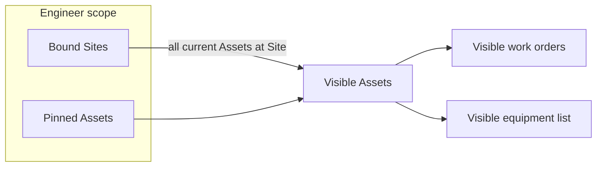
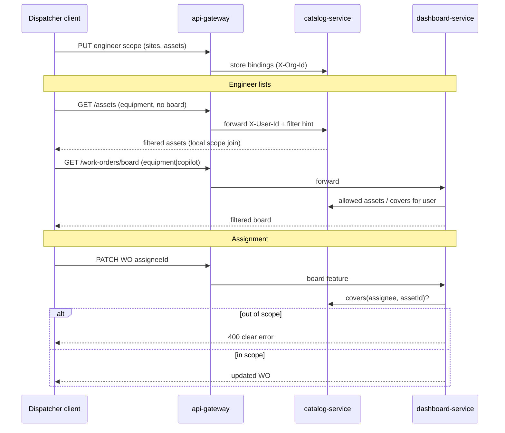

# Engineer Scope Binding - Plan

## Goal Capsule

- **Objective:** Let a dispatcher bind each engineer to Sites (цеха) and/or Assets so the engineer’s work-order and equipment lists show only that live scope, and so assignment cannot target an engineer outside the WO’s equipment scope.
- **Product authority:** This Product Contract (brainstorm 2026-07-27). Adjacent: Site/Asset in catalog; WO `assigneeId` on the board; features-only ACL; deferred `user_site_access` note in Zitadel AUTHORIZATION.
- **Open blockers:** None.
- **Product Contract preservation:** Product Contract unchanged.

**Target repos (multi-repo workspace):** `catalog-service` (bindings + asset list filter), `api-gateway-service`, `dashboard-service`, `client-app`; docs touch `masterdoc` / `masterdoc-zitadel` as noted per unit. Paths below are **repo-relative to the unit’s target repo** unless prefixed with the repo name.

---

## Product Contract

### Summary

Dispatchers maintain a durable engineer scope: a set of Sites and/or Assets. An engineer with an empty scope sees empty filtered lists. Scope is live for Sites (new Assets at a bound Site appear automatically) and additive for explicit Asset pins. Filtering applies to work-order and equipment lists for engineers; assignment of a work order is allowed only to engineers whose scope covers that work order’s Asset.

### Problem Frame

Engineers today see org-wide equipment and work orders once they have product features. There is no durable user↔Site/Asset membership—only per-WO `assigneeId`. That forces engineers to hunt among irrelevant objects and lets dispatchers assign the wrong person without a scope check.

### Key Decisions

- **Filter lists, not hard ACL** `(session-settled: user-directed — chosen over hard ACL / routing-only: engineer should see only their objects in lists; deep-link ACL out of v1)`.
- **Site and/or Asset pins, union** `(session-settled: user-directed — chosen over Site-only or Asset-only: dispatcher can bind a whole цех and/or specific units)`.
- **Empty scope ⇒ empty filtered lists** `(session-settled: user-directed — chosen over org-wide default: unconfigured engineer sees nothing until bound)`.
- **Admin owns binding UI/API** `(session-settled: user-directed — chosen over dispatcher / both: admin manages who covers what via Users; dispatcher retains WO assignment within scope)`.
- **Filter work orders + equipment** `(session-settled: user-directed — chosen over WO-only or WO+equipment+Sites catalog: Sites remain context of scoped objects, not a filtered Sites admin list)`.
- **Assignment must respect scope** `(session-settled: user-directed — chosen over assignee override: dispatcher cannot assign a WO to an engineer whose scope excludes that Asset)`.
- **Live Site membership + Asset pins (approach A)** `(session-settled: user-directed — chosen over snapshot expand / Site-first-exceptions-only: new Assets at a bound Site enter scope automatically)`.
- **Admin and dispatcher lists are unfiltered by engineer scope** `(session-settled: user-approved — agent call-out; user confirmed synthesis)`.
- **Asset pin survives Site move** `(session-settled: user-approved — agent call-out; user confirmed synthesis)`.

### Actors

- A1. **Engineer** — consumes filtered WO and equipment lists; does not edit own scope.
- A2. **Dispatcher** — assigns WOs only within scope; reads scope/candidates for assignee picker; does not create or change bindings in v1.
- A3. **Admin** — owns binding UI/API write (engineer scope management via Admin → Users); sees unfiltered org catalogs where admin features apply.

### Key Flows

- F1. Bind engineer to Site and/or Assets
  - **Trigger:** Dispatcher opens engineer scope management.
  - **Actors:** A2
  - **Steps:** Select engineer; add/remove Sites and/or Assets; save.
  - **Outcome:** Engineer’s scope is the union of all Assets at bound Sites plus pinned Assets.
  - **Covered by:** R1, R2, R3

- F2. Engineer browses filtered lists
  - **Trigger:** Engineer opens work orders or equipment.
  - **Actors:** A1
  - **Steps:** Client loads lists; server (or agreed filter point) returns only in-scope rows; empty scope yields empty lists.
  - **Outcome:** Engineer does not see out-of-scope WO/Asset rows in those lists.
  - **Covered by:** R4, R5, R6

- F3. Assign work order within scope
  - **Trigger:** Dispatcher assigns a WO to an engineer.
  - **Actors:** A2
  - **Steps:** System offers or accepts only engineers whose scope includes the WO’s Asset; reject otherwise.
  - **Outcome:** No assignee outside scope for that Asset.
  - **Covered by:** R7

### Requirements

**Binding model**

- R1. An engineer’s scope is a durable, org-scoped set of Site ids and Asset ids maintained by a dispatcher.
- R2. An Asset is in scope if its id is pinned **or** its current `siteId` is a bound Site (live membership).
- R3. Removing a Site or pin immediately removes the corresponding visibility (except Assets still covered by another Site or pin).

**Engineer visibility**

- R4. Engineer work-order lists include only WOs whose Asset is in the engineer’s scope.
- R5. Engineer equipment lists include only Assets in the engineer’s scope.
- R6. An engineer with zero Sites and zero pins sees empty filtered WO and equipment lists.

**Assignment**

- R7. Assigning a work order to an engineer succeeds only if that engineer’s scope includes the WO’s Asset; otherwise the action is rejected with a clear error to the dispatcher.

**Who can edit**

- R8. Only the admin feature path (`admin`) can create or change engineer scope bindings; dispatcher retains read access for WO candidate lists. See `docs/superpowers/specs/2026-07-28-admin-engineer-scope-binding-design.md`.
- R9. Admin and dispatcher product surfaces that list org equipment or work orders are not filtered by engineer scope.

**Move / pin semantics**

- R10. If a pinned Asset moves to another Site, the pin remains valid; Site-only coverage applies only while the Asset’s current Site is bound.

### Acceptance Examples

- AE1. Empty scope
  - **Covers:** R6
  - **Given:** Engineer E has no Sites and no pins.
  - **When:** E opens work orders and equipment.
  - **Then:** Both lists are empty.

- AE2. Live Site coverage
  - **Covers:** R2, R5
  - **Given:** E is bound to Site S; Asset A is created at S.
  - **When:** E opens equipment.
  - **Then:** A appears without further binding.

- AE3. Pin without Site
  - **Covers:** R2, R4
  - **Given:** E is pinned to Asset B at Site T; E is not bound to T.
  - **When:** A WO exists for B.
  - **Then:** E sees B and that WO; other Assets at T remain hidden.

- AE4. Assignment blocked
  - **Covers:** R7
  - **Given:** E’s scope excludes Asset C; WO W targets C.
  - **When:** Dispatcher tries to assign W to E.
  - **Then:** Assignment fails; E is not shown as a valid assignee for W (or is rejected if forced).

- AE5. Asset move with pin
  - **Covers:** R10
  - **Given:** E is pinned to Asset D at Site S1; D moves to Site S2; E is not bound to S2.
  - **When:** E opens equipment.
  - **Then:** D remains visible via the pin.

### Scope Boundaries

**In scope**

- Durable engineer ↔ Site / Asset binding
- Filter engineer WO + equipment lists
- Constrain WO assignment by scope
- Dispatcher-managed binding UX/API

**Deferred**

- Hard ACL on deep links / direct id fetch
- Admin-managed binding
- Filtering the Sites catalog itself for engineers
- Auto-suggestion of best engineer by load/skills
- Snapshot (“freeze current Assets of Site”) binding mode
- Requester / reporter scoped lists
- Extracting bindings into a standalone access-service (only if membership grows beyond Site/Asset scope)

**Out of product identity for this slice**

- Replacing features-only product ACL (`GET /me` features)
- Storing Site membership inside Zitadel IdP

### Dependencies / Assumptions

- Site and Asset already exist org-scoped in catalog; Asset has `siteId`.
- Work orders already carry `assetId`, `siteId`, `assigneeId`.
- Product auth remains features-only; engineer vs dispatcher is expressed via existing feature/role mapping into product surfaces.
- Assumption: “dispatcher” in this contract means the board/operations actor who already assigns WOs—not a new IdP role key invented here.
- Assumption: MVP bindings live in catalog-service next to Site/Asset; AUTHORIZATION’s `access-service` name remains a future extraction option, not a v1 deployable.

### Outstanding Questions

**Resolved in Planning Contract (KTDs)** — former “Deferred to Planning” items, including service home (catalog, not new access-service).

**Deferred to implementation**

- Exact route path naming for scopes (`/user-scopes` vs `/engineer-scopes`) — pick one and keep consistent in gateway + client.
- Persistence beyond in-memory MVP store (same class of decision as catalog/dashboard today).

### Sources / Research

- `masterdoc-zitadel/docs/AUTHORIZATION.md` — `user_site_access` deferred to future access-service; IdP does not store it (MVP realizes the *capability* in catalog).
- `masterdoc/docs/superpowers/specs/2026-07-24-sites-black-box-design.md` — Site = цех; Asset.siteId.
- `masterdoc/docs/superpowers/specs/2026-07-25-work-orders-board-design.md` — WO requires assetId/siteId; assigneeId.
- `feature-service/docs/superpowers/specs/2026-07-21-features-only-access-design.md` — features-only product ACL.
- `catalog-service` Site/Asset models; `dashboard-service` WorkOrder model — grounding confirmed 2026-07-27.

---

## Planning Contract

### Key Technical Decisions

- KTD1. **`catalog-service` owns bindings** `(session-settled: user-directed — chosen over new access-service: avoid new deployable for small CRUD; live Site→Asset join stays local; extract later if needed)`. Store org-scoped `{ userId → siteIds[], assetIds[] }` beside Site/Asset. Feature-service stays features-only. Dashboard calls catalog for `covers` / candidates (R7).
- KTD2. **Engineer-like filter rule** — Apply list filters when the caller has **neither** `board` nor `admin`. Callers with `board` and/or `admin` see unfiltered org lists (R9). Dual-grant users are treated as dispatcher/admin path.
- KTD3. **Unlock engineer WO list reads** — Today gateway gates all `/work-orders*` with `board` only, so engineers cannot load WO lists. Expand **GET** list/board (and GET-by-id if already used) to also allow `equipment` and/or `copilot`; keep **mutating** WO routes `board`-only. Filtering on lists still applies per KTD2.
- KTD4. **Filter at catalog + dashboard list endpoints** — Services receive `X-Org-Id`, `X-User-Id`, and a feature hint so they can apply KTD2. Catalog filters assets in-process using its own scope store. Dashboard asks catalog `covers` / allowed asset ids for board filter. Empty binding ⇒ empty list. No hard ACL on GET-by-id in v1.
- KTD5. **Live coverage resolution** — `covers(user, asset)` = asset id in pins **OR** asset’s current `siteId` in bound Sites. Implemented inside catalog (local Asset store + scope store).
- KTD6. **Binding + candidate APIs gated by `board`** — Writes and dispatcher reads of scopes require `board` (R8). Do **not** require `admin`.
- KTD7. **Binding UX on Board** — Scope editor reachable from Board / WO flows (user picker + Site/Asset multi-select), not under Admin Users. Assignee picker filters candidates via catalog for the WO’s Asset.
- KTD8. **R7 on PATCH assignee** — dashboard rejects non-null assignee when catalog `covers` is false; clearing assignee remains allowed. API can ship before rich assignee UI (U4 before U6).

### High-Level Technical Design

### Alternative Approaches Considered

- **New access-service** — Deferred: matches AUTHORIZATION naming, but MVP cost (new repo, CI, Compose, VPS) is disproportionate; extract if membership grows beyond Site/Asset scope.
- **Bindings in dashboard-service** — Rejected: catalog asset lists would depend on dashboard for filtering.
- **Bindings in feature-service** — Rejected: features-only product ACL must stay clean.
- **Snapshot Site→Assets on bind** — Rejected at product (approach B); live membership is Product Contract.
- **Client-only filtering** — Rejected: trivial to bypass; lists must filter server-side for R4–R6.

### Assumptions

- In-memory scope store in catalog MVP is acceptable (parity with existing Site/Asset stores).
- Gateway already forwards `X-Org-Id` / `X-User-Id`; extend to pass caller feature set (or `X-Scope-Filter`) so services can apply KTD2 without calling feature-service.
- Empty-scope blanking of engineer equipment is accepted ops risk; dispatchers bind before field use.
- Assignee UI is thin today (read-only in detail); U6 adds picker + candidate filter.
- Dashboard gains a catalog base URL (or shared internal URL) for covers/candidates calls.

### System-Wide Impact

- Catalog gains a user-membership concern (acceptable for MVP; document extraction path).
- Engineer clients with `equipment`/`copilot` gain WO list access (previously board-only) — intentional for R4.
- Unbound engineers see empty equipment immediately after filter ships — ship binding UX (U5) in the same release train when possible.
- AUTHORIZATION.md should note capability lives in catalog until/unless extracted.

### Risks

- Catalog boundary creep — mitigate by keeping API surface narrow (scope CRUD + covers + candidates only).
- Feature heuristic misclassifies dual-grant users — mitigated by KTD2 explicit rule and tests.
- Dashboard↔catalog coupling for every board list — mitigate with compact allowed-asset-id set; cache only if measured slow.

---

## Implementation Units

### U1. Catalog: binding store and resolve APIs

- **Goal:** Durable org-scoped engineer bindings and `covers` / candidates resolution next to Site/Asset.
- **Requirements:** R1, R2, R3, R10; supports R4–R7 (cites KTD1, KTD5)
- **Dependencies:** None
- **Target repo:** `catalog-service`
- **Files:**
  - Scope store + routes/DTOs beside existing Site/Asset module in `Application.kt` (or extracted files)
  - Tests for scope CRUD, org isolation, covers matrix
- **Approach:** Store `{ orgId, userId → siteIds[], assetIds[] }`. APIs: get/put scope for user; `covers(orgId, userId, assetId)` using local Asset.siteId; list users covering an asset (candidates). Org via `X-Org-Id`.
- **Patterns to follow:** Existing `SiteStore` / `AssetStore` ConcurrentHashMap + route tests.
- **Test scenarios:**
  - Put/get scope round-trip per org
  - Org A cannot read org B bindings
  - `covers` true via Site membership; true via pin; false when neither
  - Covers AE5: pin remains after asset move (siteId changes; pin still matches)
  - Empty scope: covers always false
- **Execution note:** Prefer test-first on store + covers matrix before HTTP wiring.

### U2. Gateway: proxy scope routes and feature hints

- **Goal:** Public routes for scope CRUD/resolve; forward identity and filter policy to downstream.
- **Requirements:** R8, R9 (policy plumbing); supports KTD3, KTD6
- **Dependencies:** U1
- **Target repo:** `api-gateway-service`
- **Files:**
  - Route registration beside `EquipmentRoutes.kt` / config (catalog base URL already exists)
  - Tests for feature gates on scope routes
  - Split GET vs mutating feature lists for `/work-orders*` (KTD3)
- **Approach:** Proxy scope paths to catalog with **writes and dispatcher reads requiring `board`**. Forward `X-Org-Id`, `X-User-Id`. For `/assets` and `/work-orders` proxies, attach caller features or `X-Scope-Filter` derived from KTD2.
- **Patterns to follow:** `proxyPrefix` in `EquipmentRoutes.kt`; admin feature gates in `AdminUserRoutes.kt`.
- **Test scenarios:**
  - Scope PUT without `board` → 403
  - Scope PUT with `board` → proxied to catalog
  - Proxied list calls include user id + filter hint headers
  - Engineer feature can GET work-orders board; cannot PATCH without board

### U3. Catalog: filter GET /assets for engineer-like callers

- **Goal:** Equipment lists honor scope (R5, R6, AE1–AE3, AE5).
- **Requirements:** R5, R6, R2, R9, R10 (cites KTD2, KTD4)
- **Dependencies:** U1, U2
- **Target repo:** `catalog-service`
- **Files:**
  - Asset list route filter using scope store
  - `AssetRoutesTest.kt` (extend)
- **Approach:** On `GET /assets`, if filter hint says engineer-like, return only assets in scope (pins ∪ assets at bound Sites); empty binding ⇒ empty `items`. board/admin hint ⇒ unfiltered. GET-by-id unchanged.
- **Patterns to follow:** Existing `list(orgId, siteId)` filtering; org header tests.
- **Test scenarios:**
  - Covers AE1: empty scope ⇒ empty list
  - Covers AE2: new asset at bound Site appears without rebinding
  - Covers AE3: pin-only asset visible; sibling assets at same Site hidden
  - Covers AE5: pin survives move
  - board/admin hint ⇒ full org list

### U4. Dashboard: filter board lists + enforce R7 on assignee PATCH

- **Goal:** WO lists filtered for engineers; assignment cannot target out-of-scope engineers.
- **Requirements:** R4, R6, R7, R9; AE1, AE4 (cites KTD3, KTD4, KTD8)
- **Dependencies:** U1, U2
- **Target repo:** `dashboard-service` (+ gateway KTD3 already in U2)
- **Files:**
  - `Application.kt` board GET + PATCH assignee
  - Catalog HTTP client for covers / allowed asset ids
  - `WorkOrderRoutesTest.kt`
  - Env for catalog base URL if missing
- **Approach:** On board GET with engineer-like hint, keep only WOs whose `assetId` is allowed (empty ⇒ empty). On PATCH with non-null `assigneeId`, call catalog `covers`; else 400 with clear message. Clear assignee allowed.
- **Patterns to follow:** Existing PATCH assignee parsing; closed-status guard.
- **Test scenarios:**
  - Covers AE1: empty scope engineer board empty
  - Engineer sees only in-scope WOs
  - board/admin unfiltered board
  - Covers AE4: PATCH assignee out of scope → 400; in scope → 200
  - Clear assignee succeeds without covers check

### U5. Client: dispatcher scope editor on Board

- **Goal:** Dispatcher can bind Sites and/or Assets to an engineer (F1).
- **Requirements:** R1, R3, R8 (cites KTD6, KTD7)
- **Dependencies:** U2
- **Target repo:** `client-app`
- **Files:**
  - Auth/API client for scope endpoints
  - Board-adjacent UI for engineer scope
  - Wire from Board; feature-gate with `board`
  - Repository tests
- **Approach:** Pick engineer via board-gated user directory (add thin list if needed — do not require `admin`). Multi-select Sites and Assets; PUT scope. Mirror checkbox patterns from invite features / SitesTab without placing under Admin.
- **Patterns to follow:** Invite feature multi-select; `BlackBoxScreen` user dropdown; `BoardScreen` navigation.
- **Test scenarios:**
  - Save round-trip serializes siteIds + assetIds
  - UI hidden without `board`
  - Removing a Site issues updated PUT without that id

### U6. Client: assignee picker constrained by scope

- **Goal:** Dispatcher assigns only in-scope engineers (F3 / AE4) with clear UX.
- **Requirements:** R7 (cites KTD7, KTD8)
- **Dependencies:** U4, U5
- **Target repo:** `client-app`
- **Files:**
  - `WorkOrderDetailScreen.kt` (assignee currently read-only)
  - WorkOrders repository PATCH + candidates fetch
  - Tests for error surfacing
- **Approach:** Assignee control lists candidates from catalog “users covering asset”; PATCH on change; show server error if rejected. Clearing assignee allowed.
- **Patterns to follow:** Existing duration/status edit + error text on detail screen.
- **Test scenarios:**
  - Covers AE4: out-of-scope engineer not in candidates (or rejected with visible error)
  - In-scope assign succeeds
  - Clear assignee works

---

## Verification Contract

- **Unit/service tests:** Gradle `test` in catalog, gateway, dashboard; client shared/compose tests for U5–U6.
- **No heavy local full builds** for Wasm/desktop — rely on GitHub Actions per repo after push.
- **Manual smoke (post-deploy):** dispatcher binds engineer to one Site; engineer equipment list shows only that Site’s assets; empty-scope engineer sees empty; PATCH assignee out of scope fails.
- **AE coverage map:** AE1→U3/U4; AE2→U3; AE3→U3; AE4→U4/U6; AE5→U1/U3.

---

## Definition of Done

- All U1–U6 merged with green CI (and deploy where the repo deploys on main/master).
- Product Contract R1–R10 satisfied by automated tests and/or smoke above.
- `masterdoc-zitadel/docs/AUTHORIZATION.md` updated: Site/Asset scope capability lives in catalog MVP; standalone access-service remains optional extraction.
- Unbound engineers intentionally see empty filtered lists; ops bind path documented in a short masterdoc or catalog note.

---

## Appendix

### Research breadcrumbs

- Gateway WO gate today: `api-gateway-service` `EquipmentRoutes.kt` — `/work-orders` → features `board` only (KTD3 unlock needed).
- Assignee PATCH today: `dashboard-service` — no scope check.
- Features catalog: `feature-service` `FeatureCatalog.kt` — no site-scoped features.
- Deferred naming: `masterdoc-zitadel/docs/AUTHORIZATION.md` — `user_site_access` → future access-service (MVP = catalog).
