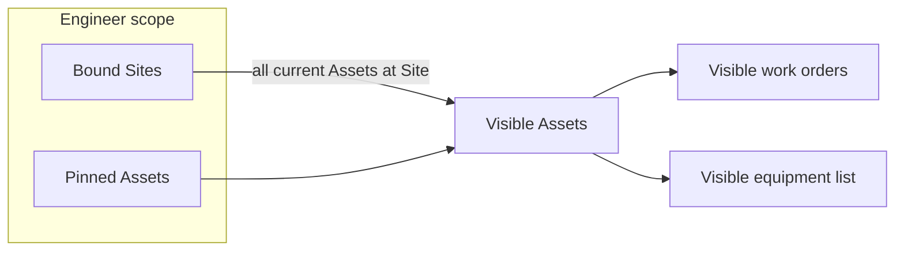

# Engineer Scope Binding - Plan

## Goal Capsule

- **Objective:** Let a dispatcher bind each engineer to Sites (цеха) and/or Assets so the engineer’s work-order and equipment lists show only that live scope, and so assignment cannot target an engineer outside the WO’s equipment scope.
- **Product authority:** This Product Contract (brainstorm 2026-07-27). Adjacent: Site/Asset in catalog; WO `assigneeId` on the board; features-only ACL; deferred `user_site_access` note in Zitadel AUTHORIZATION.
- **Open blockers:** None for planning. Service ownership of the binding store is deferred to planning.

## Product Contract

### Summary

Dispatchers maintain a durable engineer scope: a set of Sites and/or Assets. An engineer with an empty scope sees empty filtered lists. Scope is live for Sites (new Assets at a bound Site appear automatically) and additive for explicit Asset pins. Filtering applies to work-order and equipment lists for engineers; assignment of a work order is allowed only to engineers whose scope covers that work order’s Asset.

### Problem Frame

Engineers today see org-wide equipment and work orders once they have product features. There is no durable user↔Site/Asset membership—only per-WO `assigneeId`. That forces engineers to hunt among irrelevant objects and lets dispatchers assign the wrong person without a scope check.

### Key Decisions

- **Filter lists, not hard ACL** `(session-settled: user-directed — chosen over hard ACL / routing-only: engineer should see only their objects in lists; deep-link ACL out of v1)`.
- **Site and/or Asset pins, union** `(session-settled: user-directed — chosen over Site-only or Asset-only: dispatcher can bind a whole цех and/or specific units)`.
- **Empty scope ⇒ empty filtered lists** `(session-settled: user-directed — chosen over org-wide default: unconfigured engineer sees nothing until bound)`.
- **Dispatcher owns binding UI/API** `(session-settled: user-directed — chosen over admin / both: exploitation side manages who covers what)`.
- **Filter work orders + equipment** `(session-settled: user-directed — chosen over WO-only or WO+equipment+Sites catalog: Sites remain context of scoped objects, not a filtered Sites admin list)`.
- **Assignment must respect scope** `(session-settled: user-directed — chosen over assignee override: dispatcher cannot assign a WO to an engineer whose scope excludes that Asset)`.
- **Live Site membership + Asset pins (approach A)** `(session-settled: user-directed — chosen over snapshot expand / Site-first-exceptions-only: new Assets at a bound Site enter scope automatically)`.
- **Admin and dispatcher lists are unfiltered by engineer scope** `(session-settled: user-approved — agent call-out; user confirmed synthesis)`.
- **Asset pin survives Site move** `(session-settled: user-approved — agent call-out; user confirmed synthesis)`.

### Actors

- A1. **Engineer** — consumes filtered WO and equipment lists; does not edit own scope.
- A2. **Dispatcher** — creates/updates engineer Site and Asset bindings; assigns WOs only within scope.
- A3. **Admin** — not the owner of binding in v1; sees unfiltered org catalogs where admin features apply.

### Key Flows

- F1. Bind engineer to Site and/or Assets
  - **Trigger:** Dispatcher opens engineer scope management.
  - **Actors:** A2
  - **Steps:** Select engineer; add/remove Sites and/or Assets; save.
  - **Outcome:** Engineer’s scope is the union of all Assets at bound Sites plus pinned Assets.
  - **Covered by:** R1, R2, R3

- F2. Engineer browses filtered lists
  - **Trigger:** Engineer opens work orders or equipment.
  - **Actors:** A1
  - **Steps:** Client loads lists; server (or agreed filter point) returns only in-scope rows; empty scope yields empty lists.
  - **Outcome:** Engineer does not see out-of-scope WO/Asset rows in those lists.
  - **Covered by:** R4, R5, R6

- F3. Assign work order within scope
  - **Trigger:** Dispatcher assigns a WO to an engineer.
  - **Actors:** A2
  - **Steps:** System offers or accepts only engineers whose scope includes the WO’s Asset; reject otherwise.
  - **Outcome:** No assignee outside scope for that Asset.
  - **Covered by:** R7

### Requirements

**Binding model**

- R1. An engineer’s scope is a durable, org-scoped set of Site ids and Asset ids maintained by a dispatcher.
- R2. An Asset is in scope if its id is pinned **or** its current `siteId` is a bound Site (live membership).
- R3. Removing a Site or pin immediately removes the corresponding visibility (except Assets still covered by another Site or pin).

**Engineer visibility**

- R4. Engineer work-order lists include only WOs whose Asset is in the engineer’s scope.
- R5. Engineer equipment lists include only Assets in the engineer’s scope.
- R6. An engineer with zero Sites and zero pins sees empty filtered WO and equipment lists.

**Assignment**

- R7. Assigning a work order to an engineer succeeds only if that engineer’s scope includes the WO’s Asset; otherwise the action is rejected with a clear error to the dispatcher.

**Who can edit**

- R8. Only the dispatcher role/capability path can create or change engineer scope bindings in v1.
- R9. Admin and dispatcher product surfaces that list org equipment or work orders are not filtered by engineer scope.

**Move / pin semantics**

- R10. If a pinned Asset moves to another Site, the pin remains valid; Site-only coverage applies only while the Asset’s current Site is bound.

### Acceptance Examples

- AE1. Empty scope
  - **Covers:** R6
  - **Given:** Engineer E has no Sites and no pins.
  - **When:** E opens work orders and equipment.
  - **Then:** Both lists are empty.

- AE2. Live Site coverage
  - **Covers:** R2, R5
  - **Given:** E is bound to Site S; Asset A is created at S.
  - **When:** E opens equipment.
  - **Then:** A appears without further binding.

- AE3. Pin without Site
  - **Covers:** R2, R4
  - **Given:** E is pinned to Asset B at Site T; E is not bound to T.
  - **When:** A WO exists for B.
  - **Then:** E sees B and that WO; other Assets at T remain hidden.

- AE4. Assignment blocked
  - **Covers:** R7
  - **Given:** E’s scope excludes Asset C; WO W targets C.
  - **When:** Dispatcher tries to assign W to E.
  - **Then:** Assignment fails; E is not shown as a valid assignee for W (or is rejected if forced).

- AE5. Asset move with pin
  - **Covers:** R10
  - **Given:** E is pinned to Asset D at Site S1; D moves to Site S2; E is not bound to S2.
  - **When:** E opens equipment.
  - **Then:** D remains visible via the pin.

### Scope Boundaries

**In scope**

- Durable engineer ↔ Site / Asset binding
- Filter engineer WO + equipment lists
- Constrain WO assignment by scope
- Dispatcher-managed binding UX/API

**Deferred**

- Hard ACL on deep links / direct id fetch
- Admin-managed binding
- Filtering the Sites catalog itself for engineers
- Auto-suggestion of best engineer by load/skills
- Snapshot (“freeze current Assets of Site”) binding mode
- Requester / reporter scoped lists

**Out of product identity for this slice**

- Replacing features-only product ACL (`GET /me` features)
- Storing Site membership inside Zitadel IdP

### Dependencies / Assumptions

- Site and Asset already exist org-scoped in catalog; Asset has `siteId`.
- Work orders already carry `assetId`, `siteId`, `assigneeId`.
- Product auth remains features-only; engineer vs dispatcher is expressed via existing feature/role mapping into product surfaces.
- Assumption: “dispatcher” in this contract means the board/operations actor who already assigns WOs—not a new IdP role key invented here.
- Assumption: Implementing service may realize the deferred `user_site_access` idea (plus Asset pins); exact service boundary is planning’s choice.

### Outstanding Questions

**Deferred to Planning**

- Which service owns the binding store and APIs (new access-service vs extend catalog/feature/dashboard).
- Whether list filtering is enforced only in APIs the engineer client calls, or also as a shared gateway policy.
- Exact dispatcher UI placement (user card vs board side panel).
- How assignee candidate lists are presented when many engineers match a Site.

### Sources / Research

- `masterdoc-zitadel/docs/AUTHORIZATION.md` — `user_site_access` deferred to future access-service; IdP does not store it.
- `masterdoc/docs/superpowers/specs/2026-07-24-sites-black-box-design.md` — Site = цех; Asset.siteId.
- `masterdoc/docs/superpowers/specs/2026-07-25-work-orders-board-design.md` — WO requires assetId/siteId; assigneeId.
- `feature-service/docs/superpowers/specs/2026-07-21-features-only-access-design.md` — features-only product ACL.
- `catalog-service` Site/Asset models; `dashboard-service` WorkOrder model — grounding confirmed 2026-07-27.
