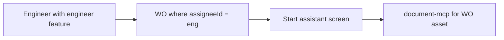
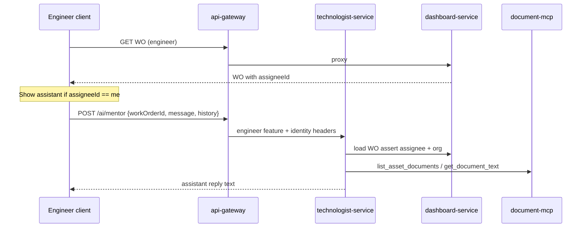
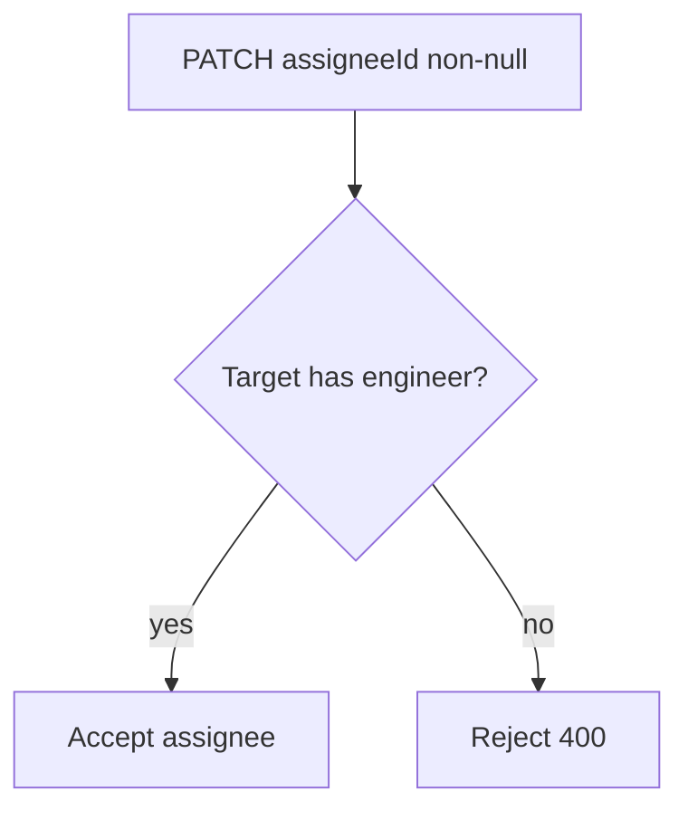

# Work-order assistant as core - Plan

**Workspace:** Fixaverse multi-repo. Implementation touches `feature-service`, `api-gateway-service`, `masterdoc-zitadel`, `technologist-service`, `dashboard-service`, `client-app`. Paths below are workspace-relative.

## Goal Capsule

- **Objective:** Make the former «Наставник» / `copilot` a core engineer capability: a multi-turn assistant on a dedicated full screen for the engineer's assigned work order, grounded in that asset's documentation via document-mcp — not a grantable feature or nav destination. Hard-enforce that dispatchers do not perform work orders.
- **Product authority:** This Product Contract (brainstorm 2026-07-28) + Planning Contract KTDs below. Adjacent: features-only ACL (`engineer` wire feature for engineer identity; `equipment` = equipment catalog only); engineer-scope binding plan; document-mcp agent pattern; `masterdocapp` Copilot out of identity.
- **Open blockers:** None.
- **Execution profile:** Test-first on service/agent contracts and client assignee gate; CI per touched repo (`./gradlew test`); push → watch Actions (no heavy local builds).
- **Stop when:** AE1–AE4 hold; `copilot` gone from catalog/nav; `/ai/mentor` works for assignee+`engineer`; board-only user cannot be WO assignee.

---

## Product Contract

### Summary

Engineers execute work orders under `engineer` access (product feature wire id `engineer`; distinct from catalog feature `equipment`).
The assistant is inseparable from that work: a button on an assigned WO opens a dedicated full-screen assistant whose answers use the WO fields plus the asset's documents through existing document-mcp tools.
The `copilot` feature and «Наставник» nav go away.
No assigned WO means no assistant UI.
Dispatchers cannot perform work orders (hard system rule).

### Problem Frame

«Наставник» today is a catalog feature (`copilot`) and a stub nav tab, while strategy and MVP notes treat AI as an accelerator on the job — not a separately sold chat product.
Leaving it grantable keeps assistants optional and competes with HubEx-style «ещё один чат».
Binding the assistant to the assigned work order keeps AI inside the work loop.

### Key Decisions

- **KD1. Assistant lives on the assigned work order** `(session-settled: user-directed — chosen over nav tab / global panel / asset-card-only: engineer work is the WO)`. Button → dedicated full screen (`WorkOrderMentorScreen`); no modal dialog overlay; no persistent assistant panel. No assignee WO → no assistant UI.
- **KD2. Any status while assignee** `(session-settled: user-directed — chosen over in-progress-only or «opened card of any own WO»: presence tracks assignment)`.
- **KD3. Stops being a feature** `(session-settled: user-directed — chosen over keeping `copilot` as hidden access key or leaving nav: assistant is not entitlement)`. Remove `copilot` from catalog, invites, IdP role keys, and client nav. Engineer product access is `engineer` (WO work + assistant); `equipment` remains the equipment catalog nav only; assistant is always part of the engineer WO surface.
- **KD4. Working assistant in v1** `(session-settled: user-directed — chosen over stub/placeholder or catalog-only change: success = answer grounded in asset docs)`.
- **KD5. Knowledge via document-mcp** `(session-settled: user-approved — chosen over new mentor corpus or generic LLM-only: reuse object documentation tools already used by other agents)`. Answers draw on WO fields plus asset docs reachable through document-mcp (`list_asset_documents`, `get_document_text`, etc.).
- **KD6. Approach A — in-client WO assistant** `(session-settled: user-directed — chosen over deep-link to masterdocapp Copilot or asset-card chat)`.
- **KD7. Dispatchers do not perform work orders — hard enforce** `(session-settled: user-directed — chosen over process-only: «жёстко диспетчер не может выполнять заявку»)`. System rejects making a board-only (non-`engineer`) user the WO assignee; assignee/performer is engineer/`engineer` territory.
- **KD8. Multi-turn while assistant screen open** `(session-settled: user-directed — chosen over one-shot: «несколько вопросов подряд»)`. In-session history for the open screen; no durable cross-session product memory in v1.
- **KD9. Assets always have documentation** `(session-settled: user-directed — chosen over empty-docs UX branch: «такого не может быть — оборудование создаётся из доков»)`. No product path for “asset with zero docs”; defensive agent handling may still refuse hallucinated procedures if MCP returns empty, but that is not a primary UX.

### Actors

- **A1. Engineer** — has `engineer`; is (or becomes) WO `assigneeId`; primary user of the assistant button and full-screen mentor.
- **A2. Dispatcher** — has `board`; assigns work to engineers; must not become assignee / perform the WO; does not use the engineer assistant as their path.
- **A3. Assistant agent** — answers in the WO mentor screen using WO context + document-mcp over the WO's asset.

### Key Flows

- F1. Open assistant from assigned WO
  - **Trigger:** Engineer opens a WO where they are `assigneeId`.
  - **Actors:** A1, A3
  - **Steps:** UI shows start-assistant control; engineer opens full-screen mentor; asks one or more questions in the same session; agent uses WO fields + document-mcp for the WO's asset; returns grounded answers.
  - **Outcome:** Engineer gets documentation-grounded help without leaving the WO.
  - **Covered by:** R1, R2, R5, R6

- F2. No assignment → no assistant
  - **Trigger:** Engineer has no WO where they are assignee (or views a WO assigned to someone else).
  - **Actors:** A1
  - **Steps:** No assistant button / mentor entry for that context.
  - **Outcome:** Assistant does not appear as a global or feature-gated product area.
  - **Covered by:** R3, R4

- F3. Entitlement cleanup
  - **Trigger:** Org admin invites or edits user features.
  - **Actors:** Admin (existing admin surface)
  - **Steps:** `copilot` / «Наставник» is not offered; engineer is granted `engineer` (and `equipment` only if catalog access is needed).
  - **Outcome:** Assistant cannot be toggled off as a feature.
  - **Covered by:** R7, R8

- F4. Dispatcher cannot perform WO
  - **Trigger:** Attempt to set WO `assigneeId` to a user without `engineer` (board-only dispatcher).
  - **Actors:** A2
  - **Steps:** API rejects; UI does not offer board-only users as performers.
  - **Outcome:** Only engineers perform WOs.
  - **Covered by:** R11

### Requirements

**Surface and access**

- R1. On a work order where the current user is `assigneeId`, the client shows a control to start the assistant on a dedicated full screen (not a modal dialog overlay, not a permanent side panel, not a top-level «Наставник» destination).
- R2. The mentor screen is a working multi-turn assistant in v1 while open: the engineer can ask several questions and receive answers grounded in that WO's fields and the linked asset's documentation.
- R3. If the user is not the WO assignee, the assistant entry point is absent for that WO.
- R4. There is no assistant UI outside an assignee WO context (no global assistant window, no standalone nav destination).

**Knowledge**

- R5. Assistant answers for a WO must use the WO's asset documentation via document-mcp (reuse existing object-doc tools; do not invent a separate mentor document store for v1).
- R6. WO text fields that describe the job are in scope as conversation context alongside asset docs.

**Product model / migration**

- R7. `copilot` is removed from the grantable feature catalog, invite/admin feature pickers, and IdP project role keys used for product features.
- R8. Client navigation no longer exposes a «Наставник» / Copilot destination gated by `copilot`.
- R9. Engineer access to perform work orders is expressed with `engineer` (and existing board-read rules updated so they do not depend on `copilot`). Catalog access to equipment lists remains `equipment`.
- R10. Org or user cannot disable the assistant as a product feature; leaving the mentor screen is fine, removing the capability is not.

**Roles**

- R11. Hard rule: dispatchers do not perform work orders — a user without `engineer` must not become WO `assigneeId`; assignment targets engineers.

### Acceptance Examples

- AE1. Covers R1, R2, R5
  - **Given:** Engineer E is `assigneeId` on WO W for asset A created from docs (docs reachable via document-mcp).
  - **When:** E opens W, starts the assistant screen, and asks two follow-up questions about steps in A's docs.
  - **Then:** Screen stays multi-turn while open; replies are usable and grounded in A's documentation.

- AE2. Covers R3, R4
  - **Given:** Engineer E is not assignee on WO W2.
  - **When:** E opens W2.
  - **Then:** No assistant start control; no top-level «Наставник» nav item.

- AE3. Covers R7, R8, R10
  - **Given:** Admin invites a new engineer.
  - **When:** Admin sets features.
  - **Then:** `copilot` / «Наставник» is not selectable; `engineer` suffices for WO work including assistant on assigned WOs.

- AE4. Covers R11
  - **Given:** Dispatcher D has `board` only (no `engineer`).
  - **When:** Someone tries to set D as WO `assigneeId`.
  - **Then:** System rejects; D assigns engineers and does not perform the WO / does not use the engineer assistant path.

### Success Criteria

- An engineer on their assigned WO can hold a multi-turn mentor session and get answers that use the asset's documentation.
- `copilot` is gone from catalog and nav; engineers are not blocked from WO work for lack of `copilot`.
- No assignee WO ⇒ no assistant UI.
- Board-only users cannot be WO assignees.

### Scope Boundaries

**In scope**

- WO-bound assistant button + dedicated full-screen mentor in client-app engineer flow.
- Remove `copilot` feature and «Наставник» nav; engineer ACL via `engineer`; catalog ACL via `equipment`.
- Ground answers with document-mcp for the WO's asset + WO fields.
- Hard enforcement that board-only users cannot be WO assignees.

**Deferred for later**

- Citation UI polish, durable cross-session chat memory, proactive agent suggestions, streaming tokens.
- Enabling engineer status mutations on own WO if still dispatcher-only in UI (orthogonal to assistant; track if field execution UX requires it).
- Changes to standalone `masterdocapp` / copilot.fixaverse.ru beyond ignore-for-this-shape.

**Outside this product's identity**

- Selling or toggling a standalone chat-mentor feature.
- Competing as a global HubEx-style chat H1 outside the work order.

### Dependencies / Assumptions

- document-mcp can list and read text for the WO's asset documents (existing tools).
- Assets are created from documentation, so a healthy asset has docs for grounding (KD9).
- Engineer WO list/read access must not require `copilot` after removal (supersede `equipment|copilot` mentions in `masterdoc/docs/plans/2026-07-27-001-feat-engineer-scope-binding-plan.md` — engineer identity is `engineer`, not `equipment`).
- Dual-grant `board`+`engineer` users may be assignees (they have `engineer`).

### Outstanding Questions

**Resolved in Planning Contract**

- Q1 → KTD1 (`POST /ai/mentor` on technologist-service).
- Q2 → KD7 / KTD2 (hard enforce assignee must have `engineer`).
- Q3 → KTD3 (strip on read + remove catalog/terraform/fixtures).
- Q4 → KTD4 (ignore `masterdocapp` Copilot for this delivery).

**Deferred to implementation**

- Exact Compose mentor screen chrome — `WorkOrderMentorScreen` with `AppScaffold` + back (not modal dialog); match existing client navigation patterns.
- Whether assignee-feature check lives only in dashboard or also gateway — prefer dashboard as source of truth with feature hint from gateway.

### Sources / Research

- `feature-service` FeatureCatalog: `copilot` / «Наставник».
- `client-app` NavCatalog / FeatureId.Copilot stub; `canAccessWorkOrderBoard` includes `copilot`; `WorkOrderDetailScreen` has no assistant UI yet.
- `api-gateway-service` EquipmentRoutes: WO reads allow `copilot`; AI proxies for technologist/validator/card only.
- `technologist-service` Agents.kt: OpenRouter + document-mcp tool loop pattern.
- `document-mcp`: `list_asset_documents`, `get_document_text`, `get_asset`.
- `masterdocapp/docs/COPILOT_SPEC.md`: separate surface — out of identity.
- Prior plan: `masterdoc/docs/plans/2026-07-27-001-feat-engineer-scope-binding-plan.md`.

---

## Planning Contract

### Key Technical Decisions

- KTD1. **Mentor agent in `technologist-service` as `POST /ai/mentor`** — Reuse `OpenRouterClient`, `HttpMcpToolClient`, and `runToolLoopUntilContent`. New agent (not validator/technologist routes). Allowlisted read tools only: `list_asset_documents`, `get_document_text`, `get_asset` (+ optional `get_document_meta`). Inject WO snapshot + pinned `assetId` every turn; no WO-mutating tools.
- KTD2. **Assignee must have `engineer`** — On PATCH assignee (non-null), dashboard rejects if the **target** user (`assigneeId`) lacks `engineer`, via feature-service (or equivalent) lookup by that userId — never the caller's feature header alone. Clearing assignee remains allowed. UI assignee picker excludes board-only users when possible.
- KTD3. **Remove `copilot` everywhere it is a product feature** — Catalog, gateway `ProductFeatures`, OpenAPI enums, Zitadel terraform role key + invite workflows, client `FeatureId.Copilot` / nav / labels / fixtures. Unknown leftover IdP grants drop via catalog filter. WO GET read features become `board` + `engineer` only. `canAccessWorkOrderBoard` drops `Copilot`.
- KTD4. **`masterdocapp` Copilot ignored** — No deep-link; no change required to ship this plan.
- KTD5. **Gateway proxy** — `proxyPrefix("/ai/mentor", technologistServiceBaseUrl, features = listOf("engineer"))`. Server still asserts caller is WO assignee.
- KTD6. **Client mentor screen** — On `WorkOrderDetailScreen`, show start control iff `assigneeId == session.user.id`. Navigate to `WorkOrderMentorScreen` (full screen, not dialog overlay). Multi-turn in-memory for the open screen; each send posts `{ workOrderId, message, history? }` (or server session id if cheaper — implementer choice, v1 not durable across app restarts). Non-streaming JSON reply first (match other `/ai/*` clients).
- KTD7. **Unassign / lose assignee mid-session** — Next send fails; client pops mentor screen and removes control.

### High-Level Technical Design

### Alternative Approaches Considered

- **Deep-link to masterdocapp Copilot** — Rejected (KD6 / KTD4): breaks WO-bound product shape.
- **New `copilot-service` / ai-gateway** — Rejected for v1: technologist-service already hosts document-mcp agents.
- **Keep `copilot` as hidden ACL key** — Rejected (KD3).
- **Process-only dispatcher rule** — Rejected (KD7).
- **Streaming NDJSON like masterdocapp ChatApi** — Deferred: higher UI cost; non-stream matches existing equipment AI clients.

### Assumptions

- Gateway can supply enough identity (`X-User-Id`, `X-Org-Id`) and a feature hint for assignee checks and mentor auth.
- WO context payload uses available fields today: title, type, status, assetId, siteId, assigneeId, PPR item ids.
- Dual `board`+`engineer` may be assignee.
- Defensive empty-MCP reply is OK under KD9 but not a marketed empty-state.

### System-Wide Impact

- Feature catalog and Zitadel role keys shrink; smoke invite workflows must drop `copilot`.
- Engineer-scope plan text that cites `equipment|copilot` for WO reads should be treated as superseded by `engineer` for WO work; `equipment` remains catalog-only.
- Technologist-service gains a chat-shaped agent (free-text, not validator JSON).
- Dashboard gains performer-eligibility check on assignee.

### Risks & Mitigations

- **Risk:** Engineers still cannot mutate WO status (readOnly board) while “performing” — assistant ships without status UX change. **Mitigation:** deferred note; do not block assistant on it.
- **Risk:** Stale `copilot` grants in live IdP. **Mitigation:** catalog filter drops unknown keys; terraform removes role for new grants.
- **Risk:** Mentor cost/latency via OpenRouter tool loops. **Mitigation:** same ops posture as other technologist agents; pin assetId to limit tool roam.

### Sequencing

1. U1 catalog/ACL strip + WO read features (unblocks engineers without `copilot`)
2. U2 client nav/fixtures cleanup (can parallel with U1 after wire values known)
3. U3 mentor agent + U4 gateway proxy
4. U5 client dialog (needs U3/U4)
5. U6 hard assignee=`engineer` enforce (can parallel after U1 feature set clarity)

---

## Implementation Units

### U1. Remove `copilot` from product ACL surfaces

- **Goal:** `copilot` is no longer a grantable/readable product feature; WO reads work on `board`|`engineer`.
- **Requirements:** R7, R9; KTD3
- **Dependencies:** none
- **Files:**
  - `feature-service/src/main/kotlin/pro/masterdoc/feature/features/FeatureCatalog.kt`
  - `feature-service/src/test/kotlin/pro/masterdoc/feature/features/FeatureCatalogTest.kt` (+ Me/JWT tests that assert copilot)
  - `api-gateway-service/src/main/kotlin/pro/masterdoc/gateway/ProductFeatures.kt`
  - `api-gateway-service/src/main/kotlin/pro/masterdoc/gateway/EquipmentRoutes.kt`
  - `api-gateway-service/openapi.yaml`
  - matching gateway tests (`WorkOrderProxyRoutesTest`, `ScopeFilterProxyRoutesTest`, `ProductFeaturesTest`)
  - `masterdoc-zitadel/terraform/main.tf`, `terraform/expected.yaml`, invite workflow role key lists, `ZitadelInvariantsTest`
- **Approach:** Delete catalog entry and mirrors; WO `readFeatures = board, engineer`; remove copilot from terraform `locals.roles` and INVITE_ROLE_KEYS; update tests.
- **Execution note:** Implement test-first on FeatureCatalog and gateway WO read gates.
- **Patterns to follow:** features-only ACL design; existing FeatureCatalogTest list assertions.
- **Test scenarios:**
  - Catalog no longer lists `copilot`; unknown grant `copilot` filtered out of `/me` features.
  - GET `/work-orders*` allowed with `engineer` without `copilot`.
  - GET `/work-orders*` still allowed with `board`.
  - Invite/role expected lists exclude `copilot`.
- **Verification:** feature-service + api-gateway-service + masterdoc-zitadel tests green for touched suites.

### U2. Client: drop Наставник nav and Copilot feature id

- **Goal:** No Copilot destination; board access via board|engineer; engineer fixtures use `engineer`.
- **Requirements:** R4, R8, R9; KTD3; Covers AE2 (nav part)
- **Dependencies:** U1 (wire catalog aligned)
- **Files:**
  - `client-app/shared/src/commonMain/kotlin/pro/masterdoc/client/navigation/NavModels.kt`
  - `client-app/shared/src/commonMain/kotlin/pro/masterdoc/client/navigation/NavCatalog.kt`
  - `client-app/shared/src/commonMain/kotlin/pro/masterdoc/client/session/ClientSession.kt`
  - `client-app/shared/.../FeatureLabels.kt` + tests
  - `client-app/shared/.../NavMenuBuilderTest.kt`
  - `client-app/composeApp/.../StubDestinationScreen.kt` (remove Copilot branch if present)
- **Approach:** Remove `FeatureId.Copilot` / nav spec; `canAccessWorkOrderBoard` = Board || Engineer; replace `engineerCopilot()` fixture with `engineerOnly()`; drop «Наставник» label.
- **Test scenarios:**
  - Covers AE2. Engineer fixture builds nav without Copilot item; board reachable via engineer.
  - Board-only fixture still gets board.
  - FeatureLabels has no Наставник entry.
- **Verification:** client-app shared navigation tests pass.

### U3. Mentor agent `POST /ai/mentor` in technologist-service

- **Goal:** Working document-mcp-grounded free-text mentor for a WO.
- **Requirements:** R2, R5, R6; KTD1, KD5, KD8, KD9
- **Dependencies:** none (service-local); integrates with dashboard WO load
- **Files:**
  - `technologist-service/src/main/kotlin/pro/masterdoc/technologist/Agents.kt` (or sibling mentor agent file)
  - `technologist-service/src/main/kotlin/pro/masterdoc/technologist/Application.kt`
  - `technologist-service/src/test/kotlin/...` agent/route tests (new or extend `AgentsTest`)
- **Approach:** New agent + route; load WO by id/org; require `assigneeId == caller`; pin `assetId`; allowlist read MCP tools; multi-turn via request history; return plain text. Prefer prefetch `list_asset_documents` like other agents.
- **Execution note:** Start with failing unit tests for allowlist (no `delete_document`) and assignee rejection.
- **Patterns to follow:** `DocumentValidatorAgent` tool loop; non-stream OpenRouter completions.
- **Test scenarios:**
  - Covers AE1 (service). Assignee + mocked MCP text → reply uses tool results / contains grounded content signal.
  - Non-assignee → 403/400.
  - History of prior turns accepted; assetId remains pinned (no cross-asset tool args).
  - Allowlist rejects/disallows delete tools.
- **Verification:** `technologist-service` `./gradlew test` for new suites.

### U4. Gateway proxy `/ai/mentor`

- **Goal:** Client reaches mentor only with `engineer`.
- **Requirements:** R9, R10; KTD5
- **Dependencies:** U3
- **Files:**
  - `api-gateway-service/src/main/kotlin/pro/masterdoc/gateway/EquipmentRoutes.kt`
  - gateway proxy tests for AI routes if present / extend
- **Approach:** Mirror `proxyPrefix` for technologist/validator/card with `features = listOf("engineer")`.
- **Test scenarios:**
  - Request without `engineer` feature denied.
  - Request with `engineer` proxied to technologist base URL path `/ai/mentor`.
- **Verification:** gateway tests green.

### U5. Client WO assistant button + multi-turn mentor screen

- **Goal:** Assignee sees start control and can chat multi-turn on `WorkOrderMentorScreen` grounded via `/ai/mentor`.
- **Requirements:** R1–R4, R6; KTD6, KTD7; F1, F2; Covers AE1, AE2
- **Dependencies:** U2, U4
- **Files:**
  - `client-app/composeApp/src/commonMain/kotlin/pro/masterdoc/client/ui/screens/WorkOrderDetailScreen.kt`
  - `client-app/composeApp/.../WorkOrderMentorScreen.kt` (dedicated full screen)
  - `client-app/composeApp/.../BoardScreen.kt` / `MainShellContent.kt` (pass `session.user.id` if missing)
  - mentor/AI repository module (extend pattern from `EquipmentModels.kt` AI posts)
  - mentor screen composable + tests under `composeApp` / `shared` as appropriate
- **Approach:** Show button iff assignee; navigate to full-screen mentor; screen holds local message list; send appends user+assistant turns; on auth/assignee error pop screen. Do not add global nav entry.
- **Execution note:** Prefer UI tests or repository contract tests for assignee gate; avoid full OpenRouter in CI — mock gateway.
- **Test scenarios:**
  - Covers AE1. Assignee sees control; after mocked mentor reply, second question keeps prior context in request or UI list.
  - Covers AE2. Non-assignee: no control.
  - Mentor 403 mid-session → screen pops / control hidden when assignee cleared.
- **Verification:** client-app tests for new coverage pass on CI targets used today.

### U6. Hard-enforce performer eligibility on assignee

- **Goal:** Board-only users cannot be WO assignees.
- **Requirements:** R11; KTD2; F4; Covers AE4
- **Dependencies:** U1 (stable feature vocabulary)
- **Files:**
  - `dashboard-service/src/main/kotlin/pro/masterdoc/dashboard/Application.kt` (assignee PATCH path)
  - `dashboard-service/src/test/kotlin/.../WorkOrderRoutesTest.kt` (or new)
  - client assignee picker if present (Board dispatcher UI) — exclude non-engineer candidates when list available
  - gateway only if feature set must be forwarded for the check
- **Approach:** When `assigneeId` set non-null, verify target has `engineer`; reject otherwise with clear error. Keep existing scope `covers` check. Clearing assignee OK.
- **Execution note:** Test-first on PATCH assignee rejection.
- **Test scenarios:**
  - Covers AE4. Assign board-only user → rejected.
  - Assign engineer user in scope → accepted.
  - Clear assignee → accepted.
- **Verification:** dashboard-service tests green.

---

## Verification Contract

- **Per-repo unit/integration tests** (CI): `feature-service`, `api-gateway-service`, `technologist-service`, `dashboard-service`, `client-app` shared/compose tests as touched; `masterdoc-zitadel` invariant tests.
- **Do not** run heavy local Gradle/Wasm/Docker image builds; push and `gh run watch` per repo.
- **Behavioral proof:** AE1 (multi-turn grounded), AE2 (no control/nav), AE3 (invite without copilot), AE4 (reject board-only assignee).
- **Cross-plan:** After U1, engineer WO reads must succeed with `engineer` alone (align with engineer-scope binding intent).

---

## Definition of Done

- All U1–U6 merged with green Actions on touched repos (test + deploy jobs where applicable).
- Product Contract R1–R11 and AE1–AE4 satisfied.
- No `copilot` in feature catalog, client nav, or Zitadel product role keys used for invites.
- `POST /ai/mentor` reachable via gateway for `engineer` assignees; document-mcp read tools used.
- Board-only assignee assignment rejected server-side.
- `masterdocapp` Copilot unchanged and not required.

---

## Appendix

### Research breadcrumbs

- Repo patterns: technologist-service Agents + EquipmentRoutes AI proxies; WorkOrderDetailScreen attachment point; FeatureCatalog removal surfaces.
- Agent-native: read-only MCP subset; UI owns WO mutations; inject WO snapshot; verify assignee + grounding + allowlist.
- External research: not load-bearing (local agent patterns sufficient).
