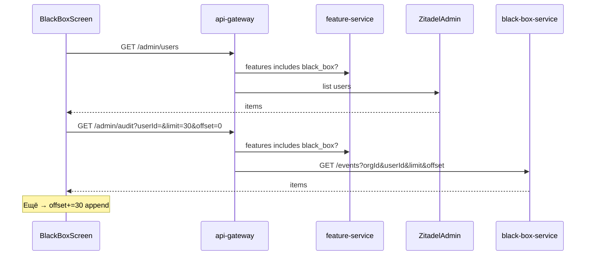

# Black-box as a product feature (journal by user)

**Date:** 2026-07-26  
**Status:** approved (ready for plan)  
**Supersedes (UI):** Admin tab «Журнал» from [2026-07-24-sites-black-box-design.md](./2026-07-24-sites-black-box-design.md)

## Problem

Audit (black-box) is readable only as a global list under **Админ → Журнал**. Admins cannot pick a user. Journal access is tied to `admin`, not a dedicated product feature.

## Goal

- Journal is a **separate product feature** «Чёрный ящик» (`black_box`).
- On that screen: dropdown **Все | пользователь** → show that user’s events (or all).
- Any org user who has `black_box` can open the journal for **any** user in the org (read-only).

## Non-goals

- New persistent storage backend (in-memory deque stays; only list query gains `offset`).
- Writing audit from the client feature screen (writes stay gateway fire-and-forget).
- Infinite scroll / virtual list (MVP: explicit «Ещё» pages).
- Date range filters / export (can follow later).
- Giving `black_box` invite/delete/user-edit powers.

## Product model

| Wire id     | Title RU       | Nav |
|-------------|----------------|-----|
| `black_box` | Чёрный ящик    | Own primary nav item |

- **Админ** keeps: Пользователи | Площадки only (no «Журнал»).
- Invite / set-features checkbox list includes «Чёрный ящик».

## UX

Screen title: **Чёрный ящик**.

1. Dropdown «Пользователь»: first option **Все**, then org users (display: name · email; value: user id).
2. Button **Обновить** — resets to page 0 (newest) with current filter.
3. **Paginated** event list (page size **30**):
   - Order: **newest first** (store already prepends; list returns head of filtered sequence).
   - First paint loads only page 0 (`offset=0&limit=30`) — do not load the full journal into UI.
   - Button **Ещё** at the bottom when the last response returned a full page (`items.size == limit`); appends next page (`offset += limit`). Hide «Ещё» when a short page returns.
   - Changing dropdown or «Обновить» clears the list and fetches page 0 again.
4. Row content (existing Russian titles via `AuditEventDescription`):
   - Filter **Все**: each row shows actor label (name/email if known, else truncated `userId`) under or beside the title.
   - Filter specific user: only that user’s events; actor label optional.
5. Empty: «Пока нет событий».
6. Errors: same humanized gateway messages as Admin where applicable.

Default filter: **Все**.

## API / auth

Keep path `GET /admin/audit` (no rename in this slice).

| Endpoint | Who |
|----------|-----|
| `GET /admin/audit?limit=&offset=&userId=` | feature `black_box` (not `admin`) |
| `GET /admin/users` (list only) | `admin` **or** `black_box` (dropdown needs the list) |
| Invite / set-features / delete / resend | `admin` only (unchanged) |

- Omit `userId` → all events for org.
- Pass `userId` → filter (already in black-box-service).
- **`limit`**: default 30, max 100 (tighten from today’s 100 default / 500 max for read UX; write path unchanged).
- **`offset`**: default 0; skip that many filtered events after newest-first order (`drop(offset).take(limit)`).
- Client: `listAudit(limit = 30, offset = 0, userId: String? = null)`.

Recording `audit.list` after successful read stays as today (actor = caller). Prefer recording once per «Обновить» / filter change, not on every «Ещё» (optional: skip audit append when `offset > 0` to avoid flooding the journal).

## Client changes

Repos: `client-app`

- `FeatureId.BlackBox("black_box")`, `NavDestinationId.BlackBox`, nav catalog entry (order near Admin, e.g. 65–75).
- `FeatureLabels` / titles: «Чёрный ящик».
- New screen (extract journal UI from `UsersScreen` `JournalTab`; Admin drops Journal tab + `AdminTab.Journal`).
- Wire in `MainShellContent` like other feature pages.
- `AdminUsersRepository.listAudit(limit, offset, userId)`.
- Black-box screen state: `offset`, accumulated `events`, `hasMore`; never bind unbounded list from a single fat request.

## Backend / IdP changes

| Repo | Change |
|------|--------|
| `feature-service` | Catalog entry `black_box` / «Чёрный ящик» |
| `api-gateway-service` | `ProductFeatures` entry; `GET /admin/audit` → `requireFeature(black_box)`; forward `limit`/`offset`/`userId`; `GET /admin/users` → allow `admin` **or** `black_box`; other admin routes stay `requireAdmin`; skip `audit.list` append when `offset > 0` |
| `masterdoc-zitadel` | Project role key `black_box`; `expected.yaml` + Smoke/Demo invite role keys include `black_box` |
| `black-box-service` | `GET /events`: honor `offset` (default 0) + `limit`; filtered sequence `drop(offset).take(limit)` (newest first unchanged) |

## Data flow

## Testing

- feature-service: catalog contains `black_box`; filter grants.
- gateway: audit 403 without `black_box`; 200 with; `userId`/`offset` forwarded; users list 200 with only `black_box`; invite still 403 without `admin`.
- black-box-service: `offset` skips newest; page N disjoint from page 0 for same filter.
- client: first load uses limit 30; «Ещё» increments offset and appends; filter/refresh resets; Admin has no Journal tab; nav shows feature when granted.
- Smoke (Fixaverse Smoke): grant `black_box`, open «Чёрный ящик», filter Все / one user, newest first, «Ещё» if enough events, Админ without Журнал.

## Migration

1. Deploy feature-service + gateway + client + Zitadel role.
2. Add `black_box` to Smoke (and Demo if needed) user grants so journal remains usable after Admin tab removal.
3. Existing admins do **not** automatically see the nav item until granted `black_box` (explicit grant; document in runbook / ensure-smoke workflow).

## Related

- [2026-07-24-sites-black-box-design.md](./2026-07-24-sites-black-box-design.md) — audit store + former Admin journal tab  
- feature-service `FeatureCatalog` / gateway `ProductFeatures` must stay aligned  
