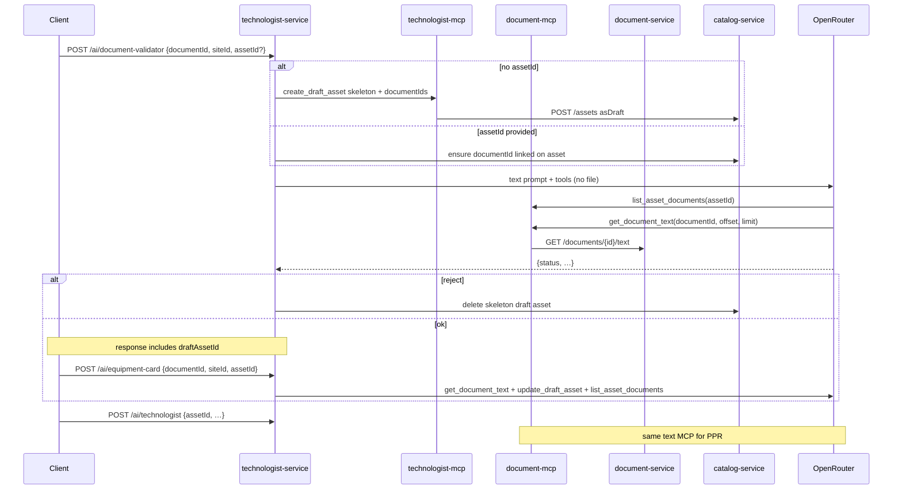

# MCP document text for AI agents (no PDF-in-LLM)

**Date:** 2026-07-26  
**Status:** approved design (awaiting implementation plan)  
**Supersedes (transport):** base64 PDF / OpenRouter `file` + `file-parser` in `technologist-service`  
**Related:** [2026-07-22-equipment-technologist-design.md](2026-07-22-equipment-technologist-design.md)

## Problem

Agents currently embed the full PDF as `data:application/pdf;base64,…` on every OpenRouter round-trip. That is expensive, slow through the egress proxy, and brittle (empty/`null` model replies, “document has no pages”). Document MCP today exposes only **metadata**, not readable content.

## Goal

LLM receives **only text prompts + function tools**. Document content for an equipment unit is read via **document-mcp** over **all documents of that asset**. No PDF bytes in the OpenRouter request body.

## Product decision (Approach A)

1. Create a **skeleton draft asset** first (or reuse existing `assetId`).
2. Attach the uploaded `documentId` to that asset.
3. Validator / equipment-card / technologist agents use MCP: `list_asset_documents` → `get_document_text` (chunked).
4. On validator `ok`, equipment-card **enriches** the draft via `update_draft_asset` (does not create a second asset).
5. On validator `reject`: delete the skeleton draft asset; **keep** the uploaded document (user can retry / inspect).

## Non-goals (this change)

- OCR for scans without a text layer (follow-up).
- Embedding search / `search_asset_documents`.
- Changing the default LLM model again.
- Publishing drafts to `active` without human confirm.

## Target flow



Smoke org (`SMOKE_ORG_IDS`) keeps deterministic mocks and does **not** call OpenRouter.

## document-mcp

### New tool: `get_document_text`

| Arg | Type | Default | Notes |
|-----|------|---------|-------|
| `documentId` | string | required | |
| `offset` | int | `0` | Char offset into extracted text |
| `limit` | int | `16000` | Max chars returned; hard cap e.g. 32000 |

**Upstream:** `GET {DOCUMENT_BASE_URL}/documents/{id}/text` (already exists).

**Result shape:**

```json
{
  "documentId": "…",
  "offset": 0,
  "length": 1234,
  "truncated": false,
  "totalChars": 50000,
  "text": "…"
}
```

If `/text` is missing or empty (corrupt PDF / no extract), return `ok:false` with a clear error so the validator can `reject`.

### Existing tools (unchanged contract)

- `list_asset_documents(assetId)` — meta for all `documentIds` on the asset  
- `get_document_meta` / `get_document`  
- `get_asset`  
- `find_documents_by_sha256`  
- `delete_document` (replace confirm path)

## technologist-mcp

| Tool | Change |
|------|--------|
| `create_draft_asset` | Used for **skeleton**: `name` like `Черновик документа`, `siteId`, `documentIds=[newDoc]`, draft + `ai_generated` |
| **`update_draft_asset`** | **New** — patch draft fields: `name`, `category`, `description`, `inventoryNo`, optional `documentIds` merge |
| `create_draft_maintenance_map` | Unchanged |
| `update_draft_maintenance_map` | Unchanged |

### catalog-service prerequisite

If `PATCH /assets/{id}` (or equivalent) does not exist, add org-scoped patch for draft assets only (or allow patch of draft fields). `update_draft_asset` calls that upstream.

Reject cleanup: delete skeleton draft asset (catalog delete-or-archive). Prefer hard-delete of draft-only rows if already supported; otherwise mark rejected / remove. Document file is **not** deleted on reject.

## technologist-service

### OpenRouter transport

- Remove `file` content parts and `plugins: file-parser` from chat completions.
- Messages: system/user **text only** + tool definitions + tool-result follow-ups.
- Log `pdfBytes=0` (or drop pdf field from request logs).

### Validator `POST /ai/document-validator`

1. Resolve `assetId`: use request `assetId` if present; else create skeleton via technologist-mcp.  
2. Ensure uploaded `documentId` is in asset `documentIds`.  
3. Run LLM tool loop with tools: `list_asset_documents`, `get_document_meta`, `get_document_text`, `get_asset`, `find_documents_by_sha256`.  
4. Inject known `assetId` / `documentId` into tool args when the model omits them.  
5. Response adds **`draftAssetId`** (and keeps `status` / `explanation` / `obsoleteDocumentIds`).  
6. On `reject`, delete skeleton if **this request created it** (not if client passed an existing asset).

### Equipment card `POST /ai/equipment-card`

- Require `assetId` (skeleton or existing).  
- LLM tools: `list_asset_documents`, `get_document_text`, `update_draft_asset` (no `create_draft_asset` in the happy path).  
- Smoke path may still create via mock tools.

### Technologist job

- Same: no PDF download for LLM; tools include `get_document_text` + `list_asset_documents` + `create_draft_maintenance_map`.

## Client

- After validator `ok`, pass returned `draftAssetId` into `createEquipmentCard` / `runEquipmentCard`.  
- UI copy can say “черновик оборудования создан, уточняем карточку…”.

## Failure / edge cases

| Case | Behavior |
|------|----------|
| `/text` empty or garbage | Validator `reject` with explanation |
| Tiny / corrupt PDF at upload | Prefer reject after failed text extract (optional size gate remains) |
| Model returns `null` / non-JSON | Keep one text-only retry asking for JSON status |
| `needs_replace` | Existing confirm-replace + `delete_document`; skeleton asset kept |
| Existing `assetId` + reject | Do **not** delete the asset; only explain |

## Success criteria

1. OpenRouter requests for validator/card/technologist have **no** base64 PDF.  
2. Logs show `get_document_text` / `list_asset_documents` MCP calls for real org runs.  
3. Validator response includes `draftAssetId` when a skeleton was created.  
4. Reject does not leave an orphan skeleton draft created by that run.  
5. Unit tests cover: text tool chunking, arg injection, skeleton-then-enrich path (fakes).

## Open follow-ups

- OCR pipeline writing `.source.txt` for scans.  
- Optional `search_asset_documents` when manuals are huge.  
- Sync model name / logging notes in the parent equipment-technologist design doc after ship.
