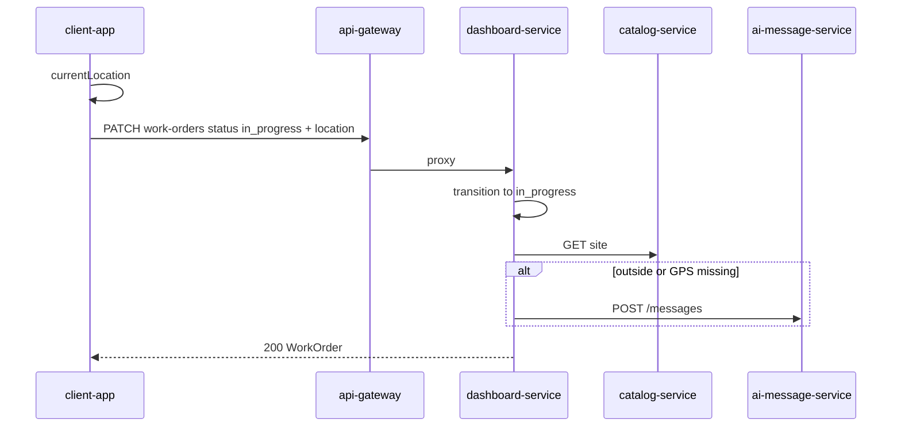

# AI messages: workshop geofence on «В работу»

**Date:** 2026-08-01  
**Status:** approved (implementing)  
**Related:** [2026-07-30-map-engineer-locations-design.md](./2026-07-30-map-engineer-locations-design.md), [2026-07-26-black-box-feature-design.md](./2026-07-26-black-box-feature-design.md)

## Problem

When an engineer starts a work order («В работу»), dispatchers have no signal that the engineer was outside the workshop geofence. Existing AI mentor chat is transient per-screen state, not an org notification feed.

## Goal

- Product feature **«ИИ»** (`ai`): paginated list of system AI messages for anyone granted the feature (typically dispatcher/manager).
- On successful `new → in_progress`, if the site has coordinates and the engineer is outside the radius (or GPS is missing), append one message. **Do not block** starting the work order.

## Non-goals

- Blocking «В работу» when outside radius.
- Push notifications / device tokens.
- Persistent DB (in-memory store like black-box MVP).
- Infinite scroll (MVP: «Ещё» pages of 30).
- LLM-generated copy (fixed Russian titles/bodies for known kinds).

## Product model

| Wire id | Title RU | Nav |
|---------|----------|-----|
| `ai` | ИИ | Own primary nav item |

Invite / set-features checkbox list includes «ИИ».

## Trigger semantics

| Condition | Result |
|-----------|--------|
| Site missing `lat` or `lon` | Skip (no message) |
| Site has coords; PATCH has no usable `location` | Message `location_missing` |
| Site has coords; distance > radius | Message `outside_workshop_radius` |
| Site has coords; distance ≤ radius | No message |

- Trigger moment: after successful status transition to `in_progress` only.
- Default radius when coords set and `geofenceRadiusM` null: **200** m.
- Optional accuracy: treat inside if `distance <= radius + accuracyM` when `accuracyM` present.
- AI message write is **best-effort**: failure must not fail the work-order PATCH.

## Site geofence fields

`catalog-service` `Site`:

| Field | Type | Notes |
|-------|------|-------|
| `lat` | `Double?` | Required with `lon` for geofence |
| `lon` | `Double?` | |
| `geofenceRadiusM` | `Int?` | > 0 when set; default 200 at check time |

Validation: lat ∈ [-90, 90], lon ∈ [-180, 180], radius > 0 if present.

Admin UI (Площадки): create/edit fields for lat, lon, radius.

## Location on PATCH

Client includes optional snapshot when starting work:

```json
{
  "status": "in_progress",
  "location": { "lat": 55.75, "lon": 37.61, "accuracyM": 12.0 }
}
```

Client obtains GPS via existing `LocationTracking` / `currentLocation()` before PATCH; if unavailable, omits `location` (server may emit `location_missing`).

## AI message model

Service: **`ai-message-service`** (port **8101**), pattern of black-box-service.

| Field | Notes |
|-------|-------|
| `id`, `orgId`, `kind`, `workOrderId`, `siteId`, `engineerId` | Required |
| `title`, `body` | RU strings |
| `distanceM`, `radiusM`, `engineerLat/Lon`, `siteLat/Lon`, `accuracyM` | Optional metrics |
| `createdAt` | ISO-8601 |

Kinds: `outside_workshop_radius`, `location_missing`.

### API

| Endpoint | Auth | Who |
|----------|------|-----|
| `POST /messages` | `X-Internal-Token` | dashboard-service only |
| `GET /messages?orgId=&limit=&offset=` | internal token (gateway) | — |
| Public `GET /ai-messages?limit=&offset=` | gateway, feature `ai` | org users with `ai` |

- `limit` default 30, max 100; `offset` default 0; newest first.
- Create endpoint not exposed publicly.

## UX

Screen title: **ИИ**.

1. Button **Обновить** — page 0.
2. Paginated list (30): newest first; **Ещё** when full page.
3. Row: title, body, createdAt; secondary: work order / engineer id as available.
4. Empty: «Пока нет сообщений».

## Repos

| Repo | Change |
|------|--------|
| `catalog-service` | Site geofence fields + validation + tests |
| `ai-message-service` | New service: store, routes, CI deploy |
| `dashboard-service` | Parse location; load site; Haversine; best-effort create message |
| `api-gateway-service` | Feature `ai`; proxy `GET /ai-messages` |
| `feature-service` | Catalog `ai` / «ИИ» |
| `masterdoc-zitadel` | Role key `ai` |
| `client-app` | Nav, screen, location on patch, site fields |

## Data flow



## Testing

- catalog: geofence validation; create/update round-trip
- ai-message-service: append, org isolation, offset pagination, token auth
- dashboard: outside → message; inside → none; missing GPS → `location_missing`; no site coords → none; AI down → PATCH 200
- gateway: `/ai-messages` requires `ai`
- client: patch includes location; nav gated; sites form fields

## Migration

1. Deploy ai-message-service + wire gateway/dashboard env (`AI_MESSAGE_SERVICE_BASE_URL`, `AI_MESSAGE_INTERNAL_TOKEN`).
2. Grant `ai` to dispatcher/manager smoke users.
3. Set lat/lon (and optional radius) on sites that should be monitored.
